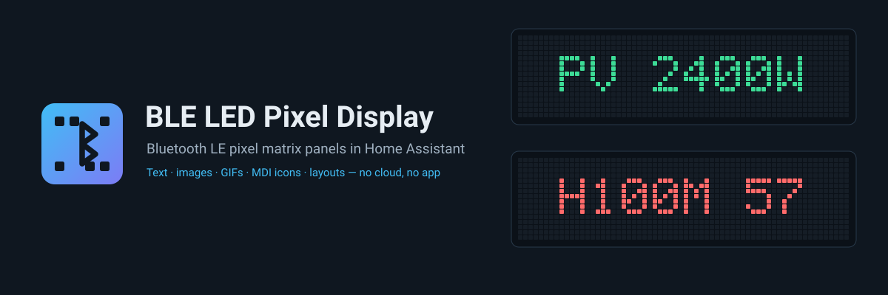
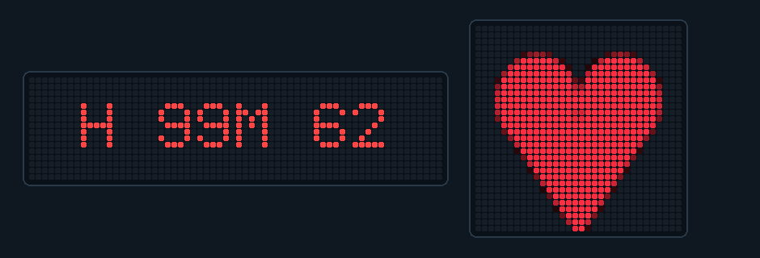
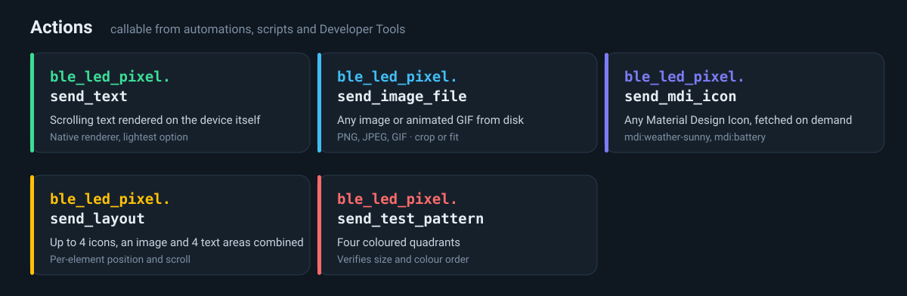

<div align="center">
  

  # BLE LED Pixel Display — Bluetooth LE Pixel Matrix Panels for Home Assistant

  **Put live Home Assistant data on a cheap Bluetooth LED panel — text, images, animated GIFs, Material Design Icons and composed layouts.**
  A custom integration for LED pixel matrix displays that speak the iPIXEL Color protocol, sold as **BGLight** and as the **B.K. Light LED Pixel Board** at Action. Fully local over Bluetooth LE — no cloud, no vendor app, no account.

  [](https://hacs.xyz)
  [](https://github.com/sphings79/ha-ble-led-pixel-display/releases)
  [](https://www.home-assistant.io)
  [](LICENSE)

  **English** · [Deutsch](README.de.md)
</div>

<div align="center">
  

  <sub>Left: live text on a 64×16 panel. Right: images on a 32×32 panel — both driven from Home Assistant.</sub>
</div>

## Table of contents

- [What this integration does](#what-this-integration-does)
- [Supported devices](#supported-devices)
- [Actions](#actions)
- [Installation](#installation)
- [Entities you get](#entities-you-get)
- [Display modes](#display-modes)
- [Avoiding flicker: how updates actually work](#avoiding-flicker-how-updates-actually-work)
- [Examples](#examples)
- [Fonts](#fonts)
- [Why this fork exists](#why-this-fork-exists)
- [Troubleshooting](#troubleshooting)
- [FAQ](#faq)
- [Further documentation](#further-documentation)
- [More Home Assistant projects](#more-home-assistant-projects)
- [Contributing](#contributing)
- [Disclaimer](#disclaimer)
- [License](#license)

## What this integration does

These panels are sold as toys — you set a message with a phone app over Bluetooth and that is it. This integration makes them a proper Home Assistant output device: a `text` entity you can write to from any automation, plus actions for images, GIFs, icons and multi-element layouts.

Typical uses:

- **Energy dashboard on the wall** — current PV production, battery state of charge, house consumption, time until the battery is full
- **Status ticker** — who is home, next calendar entry, whether the garage door is open
- **Alerts** — a red panel when a window is open while the heating runs, or when the washing machine finishes
- **Ambient info** — weather icon plus temperature, composed as a single layout

Everything runs locally over Bluetooth LE. Home Assistant's Bluetooth proxies are supported, so the panel does not have to be near the Home Assistant host.

## Supported devices

Any panel that advertises as `LED_BLE_*` with service UUID `0000fa01-0000-1000-8000-00805f9b34fb` and speaks the iPIXEL Color protocol. Known brands:

| Brand | Notes |
| --- | --- |
| **B.K. Light** | Sold at Action. Packaging reads "LED pixel board" (article **ACT1026**, 13×13 cm, 32×32) and "LED fun screen" (article **ACT1025**, 37×9 cm, 64×16); shop listings are localised, e.g. "Led-pixelbord" (article **3217439**) and "Led-pixel scherm" (article **3217438**) in the Netherlands. Product id `000702`. |
| **HYPERLITE** | Product ids `002501`–`002509`, `002513`, `002514`. Sold on Amazon as programmable scrolling signs. |
| **EZYEVY** | Product ids `002510`–`002512`. Sold on Amazon, including a 76×11 inch shop sign. |
| **BGLight** | Same protocol |
| Generic "iPixel Color" panels | Whatever the vendor app is called iPixel Color |

Brands whose listings state the panel is driven by the iPixel Color app, but
whose product id nobody has reported yet:

| Brand | Seen as |
| --- | --- |
| **Fockety** | 32×32, 5×5 inch, "for iPixel Color APP" (Amazon `B0DQJWBCPV`) |
| **CHICIRIS** | Model `CHICIRISy9830bntme`, flexible IP65 panel, 1280 RGB LEDs at 20×64, 34.8 × 10.16 cm (Amazon `B0DNFPDCKP`) |
| **LUXONIC** | 32×32 car and shop sign (Amazon `B0BCYBRP84`) |
| **Monster** (Jem Accessories) | 32×32, 6×6 inch car panel, model `MAM7-1001-ICM` (Amazon `B0DC7KY83V`, also Walmart and Home Depot). Ships under its own app name, *Monster Pixel Light* — a rebranded build of iPixel Color. Both APKs declare the same BLE UUID set (`0000fa02`, `0000fee8`, `0000fee9`, `0000ae00`–`0000ae02`, `00002902`) and share 103k string-table entries, so the app speaks this protocol. Its panel has not been confirmed on hardware. |

These are listed separately on purpose. For B.K. Light the id came from actual
hardware, for HYPERLITE and EZYEVY from the vendor's own configuration; for
Fockety, CHICIRIS and LUXONIC only from a seller's description, and for Monster
from the vendor's app rather than the panel. None of them has been confirmed on
real hardware, and a rebranded app does not prove the advertised name matches
`LED_BLE_*`. If you own one, the [reporting
flow](#your-panel-is-not-listed) turns that into a confirmed entry.

Panel resolution is read from the device itself; 64×16 is the usual size. Sizes seen in the wild so far are 32×32, 64×16, 64×20 and 96×16. If your panel reports the wrong dimensions, see [Troubleshooting](#troubleshooting).

All of these are the same hardware from one manufacturer — **Shenzhen Heaton Technology Co., Ltd.**, who also publish the iPixel Color app itself. The panels are white-label goods, so the brand on the box says nothing about the electronics inside and a new one can appear with any reseller. That is why no complete brand list exists anywhere, and why the table above grows through reports rather than from a vendor document.

How far that goes is visible in the electronics: every panel examined so far runs the same **JieLi AC6951C** microcontroller with a ZBIT SPI flash, regardless of the name on the box.

### Your panel is not listed?

It will still work. Geometry comes from the **device type**, not from the brand, so an unrecognised panel behaves exactly like a known one — only the manufacturer field in the device registry stays empty.

Two diagnostic sensors tell you what to report:

| Sensor | What it says |
| --- | --- |
| **Product ID** | The identifier the panel advertises, e.g. `000702` |
| **Device Type** | Decides the resolution |

You do not have to look them up, though. An unrecognised panel raises a notice under **Settings → System → Repairs**, and its **Learn more** button opens a bug report with the technical values already filled in — product id, device type, reported size, firmware and integration version. All that is left for you is the brand, the model, and ideally a photo of the type label on the back. A photo of the packaging is welcome but optional.

Once the id is added to the table, the notice disappears by itself.

The brand table has two sources of differing quality: the `0025` range comes from the vendor's own configuration, while `000702` was identified from actual hardware. Everything else is genuinely unknown rather than deliberately omitted.

## Actions



All actions target the panel's `text` entity and are callable from automations, scripts, and Developer Tools → Actions.

### Actions only some panels have

Four more actions drive features built into the panel's own firmware. Not every
model has them — the vendor app decides what to offer from the panel's LED type
and product id, and this integration follows the same table.

| Action | What it does |
| --- | --- |
| `show_preset` | Show one of 20 animations stored in the firmware. Six bytes on the wire, no image transfer. Which animations depends on the model: some ship road signs, others moods. |
| `set_scoreboard` | Two scores, 0–65535 each. |
| `set_countdown` | Start or stop a countdown the panel runs itself. |
| `set_stopwatch` | Start or stop a stopwatch the panel runs itself. |

The **Supported features** diagnostic sensor lists what your panel accepts.
Calling an action the panel does not support fails with an explanatory message
rather than doing nothing, because these panels acknowledge unknown commands
without complaint — a silent no-op would be indistinguishable from success.

If your panel does have one of these and the sensor says otherwise, turn on
*Offer presets, scoreboard, countdown and stopwatch anyway* in the integration
options and [open an issue](https://github.com/sphings79/ha-ble-led-pixel-display/issues)
with the Product ID sensor's value, so the table can be corrected.

Neither the elapsed stopwatch time nor the remaining countdown can be read
back — the protocol has no command for it.

### Password-protected panels

A panel can be locked with a password from the vendor app. A locked panel still
connects and still shows up normally — it just discards everything sent to it,
without an error. The **Password protection** diagnostic sensor tells you
whether that is what you are looking at.

Put the password into the integration options and it is sent after every
connect, because the panel forgets it as soon as the link drops. Most models
use six digits; two known models use four, and the integration picks the right
length from the product id.

Forgot it? [docs/password_reset.md](docs/password_reset.md) describes the
power-cycle reset. This integration cannot set or clear a password — only use
one — which is deliberate: locking yourself out is easy, and undoing it is not.

## Installation

### HACS (recommended)

1. Open HACS in Home Assistant
2. Three dots menu, top right → **Custom repositories**
3. Repository URL: `https://github.com/sphings79/ha-ble-led-pixel-display`
4. Category: **Integration** → **Add**
5. Search for **BLE LED Pixel Display**, install it
6. Restart Home Assistant

### Manual

1. Copy `custom_components/ble_led_pixel` into your Home Assistant `custom_components` directory
2. Restart Home Assistant

### Adding the panel

Power the panel on and make sure no phone is connected to it — a panel that is already connected to the vendor app will not advertise, and Home Assistant cannot find it.

Home Assistant usually discovers it by itself and offers it under **Settings → Devices & Services**. Otherwise add it manually: **Add Integration → BLE LED Pixel Display**, then pick your panel from the list. Devices whose name starts with `LED_BLE_` are marked with a star. Manual entry of a MAC address is available as a fallback.

## Entities you get

| Entity | Domain | What it does |
| --- | --- | --- |
| **Display** | `text` | The text shown on the panel. Write to it from any automation. |
| **Text Color** | `light` | Foreground colour as RGB |
| **Background Color** | `light` | Background colour as RGB |
| **Brightness** | `number` | 1–100 |
| **Mode** | `select` | `textimage`, `text` or `clock` — see [Display modes](#display-modes) |
| **Font** | `select` | TTF/OTF fonts, see [Fonts](#fonts) |
| **Font Size**, **Line Spacing** | `number` | Layout in `textimage` mode |
| **Text Animation**, **Text Speed**, **Text Rainbow** | `number` | Scrolling and effects in `text` mode |
| **Clock Style** | `select` | 9 clock faces |
| **Clock 24h**, **Clock Show Date** | `switch` | Clock options |
| **Antialiasing** | `switch` | Smoothing in `textimage` mode |
| **Auto Update** | `switch` | **Read [Avoiding flicker](#avoiding-flicker-how-updates-actually-work) before touching this** |
| **Update Display** | `button` | Renders the stored state to the panel |
| **Sync Time** | `button` | Sets the device clock |
| Device Type, Display Width, Display Height, MCU/WiFi Version | `sensor` | Diagnostics |

## Display modes

| Mode | Rendering | Good for |
| --- | --- | --- |
| **`text`** | The device renders the text itself | Scrolling tickers, lowest Bluetooth traffic, smoothest animation |
| **`textimage`** | Home Assistant renders text to an image with Pillow, then sends the image | Custom TTF fonts, precise sizing, antialiasing, multiline with `\n` |
| **`clock`** | Device-side clock | A clock, with 9 styles |

## Avoiding flicker: how updates actually work

This is the part that is not obvious, and it decides whether your panel looks smooth or flickers on every change.

**With `Auto Update` on, every single change renders immediately.** Setting the text is one Bluetooth write, setting the colour is another. Between the two, the panel briefly shows the old value in the new colour, or the new value in the old colour. On a slow Bluetooth link that gap is over a second and clearly visible.

**With `Auto Update` off, `text.set_value` and `light.turn_on` only store the value.** Nothing reaches the panel until you press the `Update Display` button — which then renders text and colour together, in a single write.

So for anything that updates regularly:

```yaml
# Once, manually: turn the Auto Update switch off.
actions:
  - action: text.set_value
    target: { entity_id: text.display }
    data: { value: "PV 2400W" }
  - action: light.turn_on
    target: { entity_id: light.text_color }
    data: { rgb_color: [0, 255, 0] }
  - action: button.press          # both land on the panel at once
    target: { entity_id: button.update_display }
```

Two further benefits: it is faster, because one Bluetooth round trip replaces two or three, and the timing gets predictable.

The one trade-off: with `Auto Update` off, changing text or colour by hand in the Home Assistant UI does nothing visible until the button is pressed. If an automation presses it regularly anyway, you will not notice.

> **Tip:** Only write the colour when it actually changed. On a panel that cycles through five screens where only one is green, that saves four Bluetooth writes per cycle.

## Examples

### Energy display cycling through several values

A single automation that rotates through PV production, battery state of charge and house consumption every five seconds:

```yaml
alias: LED panel energy cycle
triggers:
  - trigger: time_pattern
    seconds: /5
mode: single
max_exceeded: silent
variables:
  screens: >-
    
    
    
    
    
      {% set ns.l = ns.l + [{'text': 'PV %d W' | format(pv), 'color': [0, 255, 0]}] %}
    
    {% set ns.l = ns.l + [{'text': 'SoC %d%%' | format(soc), 'color': [255, 0, 0]}] %}
    {% set ns.l = ns.l + [{'text': 'H %d W' | format(house), 'color': [255, 0, 0]}] %}
    {{ ns.l }}
actions:
  - variables:
      screen: "{{ screens[(states('counter.panel_step') | int(0)) % (screens | length)] }}"
  - action: text.set_value
    target: { entity_id: text.display }
    data: { value: "{{ screen.text }}" }
  - if:
      - "{{ (state_attr('light.text_color', 'rgb_color') or []) | list != screen.color }}"
    then:
      - action: light.turn_on
        target: { entity_id: light.text_color }
        data: { rgb_color: "{{ screen.color }}" }
  - action: button.press
    target: { entity_id: button.update_display }
  - action: counter.increment
    target: { entity_id: counter.panel_step }
```

The screen list is built as data, so screens without meaning drop out of the cycle by themselves — no PV screen at night. A `counter` helper holds the position.

> **Mind the character limit.** Many panels switch to a second view when the text is longer than fits, which looks like the display jumping. Keep strings short and predictable, and pad numbers to a fixed width.

### An image or animated GIF

```yaml
- action: ble_led_pixel.send_image_file
  target: { entity_id: text.display }
  data:
    file_path: /config/www/panel/rain.gif
    resize_method: fit          # or "crop"
```

The path must be readable by Home Assistant and listed under `allowlist_external_dirs` if it is outside `/config`.

### A Material Design Icon

```yaml
- action: ble_led_pixel.send_mdi_icon
  target: { entity_id: text.display }
  data:
    icon: mdi:weather-pouring
    color: [65, 189, 245]
    scale: 1.0
```

Icons are fetched on demand, so any MDI name works without shipping the icon set.

### Weather icon and temperature side by side

```yaml
- action: ble_led_pixel.send_layout
  target: { entity_id: text.display }
  data:
    icon: mdi:weather-sunny
    icon_x: 0
    icon_y: 0
    icon_size: 16
    icon_color: [255, 193, 7]
    text: "{{ states('sensor.outside_temperature') | round(0) }}°C"
    text_x: 20
    text_y: 4
    text_color: [230, 237, 243]
```

`send_layout` composes up to four icons, an image and four independent text areas, each with its own position, colour, alignment and optional scrolling or blinking.

### Scrolling text rendered by the device

```yaml
- action: ble_led_pixel.send_text
  target: { entity_id: text.display }
  data:
    text: "Doorbell — someone is at the front door"
    color: [255, 107, 107]
    animation: 1        # scroll
    speed: 60
```

This is the lightest option: the panel does the scrolling itself, Home Assistant sends the string once.

### Checking a new panel

```yaml
- action: ble_led_pixel.send_test_pattern
  target: { entity_id: text.display }
```

Four coloured quadrants — verifies resolution and colour channel order in one shot.

## Fonts

Fonts are picked in the **Font** select entity and looked up in this order:

1. `custom_components/ble_led_pixel/fonts/` — shipped with the integration
2. The `pypixelcolor` package
3. System font directories

Whatever you pick is resolved to an absolute path and handed to the renderer that way, so the same font works in every mode and in the `send_text` action. To add your own, drop a `.ttf` or `.otf` into the integration's `fonts/` folder and restart. If a font cannot be found anywhere, `VCR_OSD_MONO` is used and a warning is logged.

Bundled: `3x5-de`, `5x5`, `7x5`, `WP7xn`, `OpenSans-Light`, `Lepidos`, `VCR_OSD_MONO`.

> **Why the paths matter:** pypixelcolor also has built-in font names, but they are not stable — 0.4 shipped `CUSONG`, `SIMSUN` and `VCR_OSD_MONO`, later versions replaced all three with a single `UNIFONT`. Upstream passed those names straight through, so a library update would have changed or broken the font. This fork resolves everything to a file path instead, and ships `VCR_OSD_MONO` so it is always available.

## Why this fork exists

This continues [cagcoach/ha-ipixel-color](https://github.com/cagcoach/ha-ipixel-color) by Christian Grund, which has had no commits since December 2025 while pull requests and issues piled up. It merges the image, MDI icon and layout work from [tigers75](https://github.com/tigers75/ha-ipixel-color) and adds fixes of its own — among them the font fallback above, and pinning `pypixelcolor` below 0.5 because the library has since removed the fonts that existing installations depend on.

**The domain is `ble_led_pixel`, not `ipixel_color`.** Both integrations can therefore be installed side by side, so you can migrate one panel at a time instead of switching everything at once.

## Troubleshooting

**The panel is not discovered.** Disconnect the vendor app first — a connected panel stops advertising. Check that Home Assistant's Bluetooth integration is set up and the panel is within range of the host or a Bluetooth proxy.

**The panel advertises but will not connect.** Check its power supply before anything else. The vendor manual requires **5 V / 2 A** and warns that an inadequate supply causes "screen shutdown, Bluetooth connection errors, or a yellowish color" — it explicitly rules out computer USB ports, car USB media ports and non-standard phone chargers. A panel that is visible in the device list but refuses every connection attempt is the exact symptom this produces. Range is the second suspect: advertising needs far less signal than a held connection, so a panel can be seen through a wall it cannot be reached through.

**The panel asks for a password, or refuses to connect after one was set.** It can be reset without the app, using nothing but the power switch — see [Resetting a password-locked panel](docs/password_reset.md).

**Wrong width or height.** The dimensions come from the device. Some firmware reports them incorrectly; check the Display Width and Display Height sensors against reality.

**Text is cut off or the display jumps between two views.** The string is longer than the panel fits. Shorten it, or use `send_text` with scrolling.

**The selected font has no effect.** Check the log for `Font ... not found in any location`. Font files belong in the integration's `fonts/` folder; a restart is needed after adding one.

**Colour and text change at different times.** See [Avoiding flicker](#avoiding-flicker-how-updates-actually-work).

**Nothing happens when I change something in the UI.** `Auto Update` is off. Press `Update Display`.

Debug logging:

```yaml
logger:
  logs:
    custom_components.ble_led_pixel: debug
```

## FAQ

**Does this need the vendor app or an account?** No. Everything is local Bluetooth LE.

**Does it work with a Bluetooth proxy?** Yes, the panel does not have to be near the Home Assistant host.

**Can I run this next to the original `ipixel_color` integration?** Yes — different domain, no conflict. Do not connect both to the same panel at the same time.

**Can I read whether the panel is switched on?** No. The protocol has a command to switch power, but none to query it. The switch reflects what Home Assistant last sent, not the device.

**How many panels can I use?** As many as your Bluetooth setup handles. Each becomes its own device.

**Which resolutions work?** Whatever the device reports, typically 64×16.

## Further documentation

- [Protocol documentation](docs/protocol.md) — the Bluetooth protocol these panels speak, reconstructed from the vendor app
- [Resetting a password-locked panel](docs/password_reset.md) — recovering a panel locked from the app

## More Home Assistant projects

- [Marstek Venus Modbus](https://github.com/sphings79/marstek_venus_modbus_dev) — Marstek Venus battery storage over local Modbus TCP
- [Shelly Modbus](https://github.com/sphings79/shelly-modbus-home-assistant) — Shelly energy meters and relays over Modbus TCP, no cloud
- [StateGuard](https://github.com/sphings79/stateguard-home-assistant) — alerts when entities go unavailable or stop reporting
- [IntegrationGuard](https://github.com/sphings79/integrationguard-home-assistant) — which of your HACS extensions is still maintained
- [MyIP.wtf](https://github.com/sphings79/myip-wtf-home-assistant) — public IPv4/IPv6, ISP and geolocation as sensors
- [Leasing KM](https://github.com/sphings79/leasing-km-home-assistant) — mileage allowance for a leased car
- [Marstek Venus BLE](https://github.com/sphings79/ha-marstek-ble) — Marstek Venus E over Bluetooth LE
- [Marstek offline endpoint](https://github.com/sphings79/Marstek-offline-endpoint) — run a Venus battery without the cloud
- [Power Flow Card Plus Mushroom](https://github.com/sphings79/power-flow-card-plus-mushroom) — power flow card with multiple batteries and PV sources

## Contributing

Issues and pull requests are welcome — especially reports from panels of other brands, and the exact model name and reported resolution.

If this integration got your energy data onto the wall, a ⭐ on the repository genuinely helps other people find it.

<a href="https://buymeacoffee.com/sphings"></a>

## Disclaimer

Unofficial, community-built integration. Not affiliated with, endorsed by, or supported by Home Assistant, Nabu Casa, Action, BGLight, or any panel manufacturer. Brand names are used only to describe compatibility. See [NOTICE](NOTICE).

## License

[GPL-3.0](LICENSE) — inherited from the original work by Christian Grund. Protocol library [pypixelcolor](https://github.com/lucagoc/pypixelcolor) by lucagoc is MIT.

---

<sub>Home Assistant LED matrix · Bluetooth LE pixel display · BGLight Home Assistant · B.K. Light LED Pixel Board Action · Led-pixelbord Action · Led-pixel scherm · LED fun screen · iPixel Color integration · LED_BLE · 64x16 pixel panel · HACS custom integration · display sensor value on LED panel · animated GIF on LED matrix · Material Design Icon on display · scrolling text ticker · energy dashboard wall display · PV production display · battery state of charge panel · no cloud · local Bluetooth · pypixelcolor</sub>
